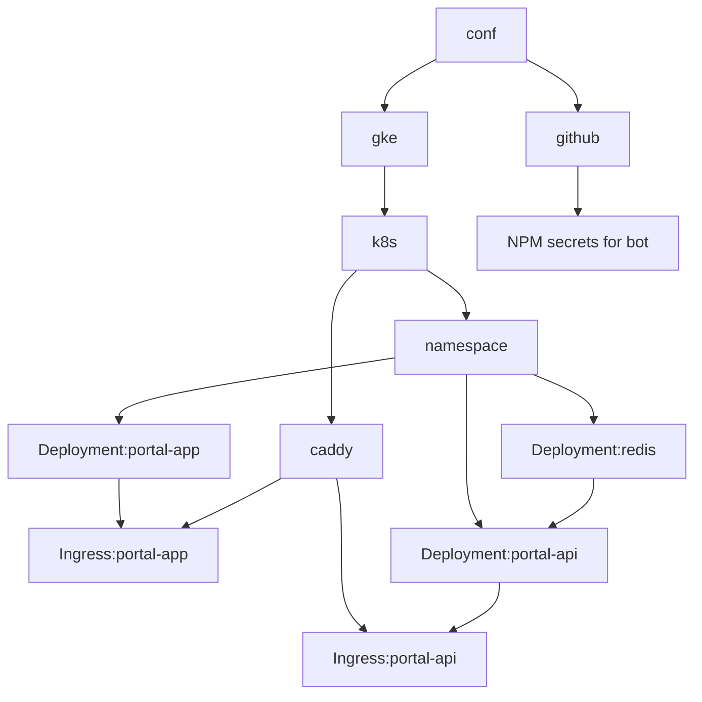

# conf

This repository contains code to deploy and configure for infrastructure related
to Flexi Soft.

We use Pulumi to manage infrastructure as code. Pulumi is a tool for creating,
deploying, and managing cloud infrastructure. It is open source and supports
multiple cloud providers.

We mainly use Kubernetes, _currently_ deployed at Google Cloud Platform.

## Prerequisites

- [Pulumi](https://www.pulumi.com/docs/get-started/install/)
- [Google Cloud SDK](https://cloud.google.com/sdk/docs/install)
- [kubectl](https://kubernetes.io/docs/tasks/tools/install-kubectl/)
- [docker](https://docs.docker.com/get-docker/)
- [nodejs](https://nodejs.org/en/download/)
- [yarn](https://classic.yarnpkg.com/en/docs/install/#debian-stable)

## Architecture

At the core, we have a Kubernetes cluster. This cluster has a namespace for each
_environment_, along with a few system namespaces. We use [Caddy] to provide a
reverse proxy for all services and handle automatic SSL certificates.

[Caddy]: https://caddyserver.com/

The portal service uses Redis to store session data.

We utilize a [12-factor] to manage most configuration.

[12-factor]: https://12factor.net/
