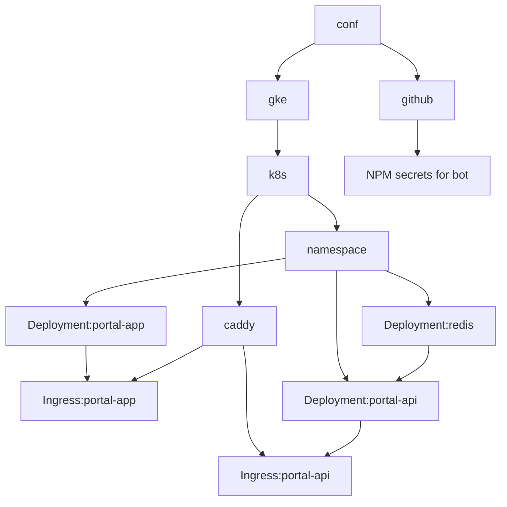

# conf

This repository contains code to deploy and configure for infrastructure related
to Flexi Soft.

We use Pulumi to manage infrastructure as code. Pulumi is a tool for creating,
deploying, and managing cloud infrastructure. It is open source and supports
multiple cloud providers.

We mainly use Kubernetes, _currently_ deployed at Google Cloud Platform.

## Prerequisites

- [Pulumi](https://www.pulumi.com/docs/get-started/install/)
- [Google Cloud SDK](https://cloud.google.com/sdk/docs/install)
- [kubectl](https://kubernetes.io/docs/tasks/tools/install-kubectl/)
- [docker](https://docs.docker.com/get-docker/)
- [nodejs](https://nodejs.org/en/download/)
- [pnpm](https://pnpm.io/installation)

## Architecture

At the core, we have a Kubernetes cluster. This cluster has a namespace for each
_environment_, along with a few system namespaces. We use [Caddy] to provide a
reverse proxy for all services and handle automatic SSL certificates.

[Caddy]: https://caddyserver.com/

The portal service uses Redis to store session data.



We utilize a [12-factor] to manage most configuration.

[12-factor]: https://12factor.net/

## Custom domains DNS Configuration

When using a custom domain with our platform, customers need to configure DNS records pointing to our infrastructure.

### Recommended: CNAME Records

For maximum flexibility, we recommend using CNAME records pointing to our ingress hostname:

```dns
# Replace portal.example.com with your actual domain
portal.example.com.                 CNAME    ingress.fpx.no.
debitor.portal.example.com.         CNAME    ingress.fpx.no.
api.portal.example.com.             CNAME    ingress.fpx.no.
onboarding.portal.example.com.      CNAME    ingress.fpx.no.
rest.portal.example.com.            CNAME    ingress.fpx.no.
```

### Alternative: A Records

If you need to use your root domain or your DNS provider doesn't support CNAME records for your use case (e.g. MX record conflicts), use A records pointing to our static IP:

```dns
# Replace example.com with your domain and <IP> with the actual IP
example.com.                 A        <IP>
debitor.example.com.         A        <IP>
api.example.com.             A        <IP>
onboarding.example.com.      A        <IP>
rest.example.com.           A         <IP>
```

> **Note**: CNAME records cannot be used for root domains. If you want to use your root domain as the main portal, you must use an A record for that specific record.
