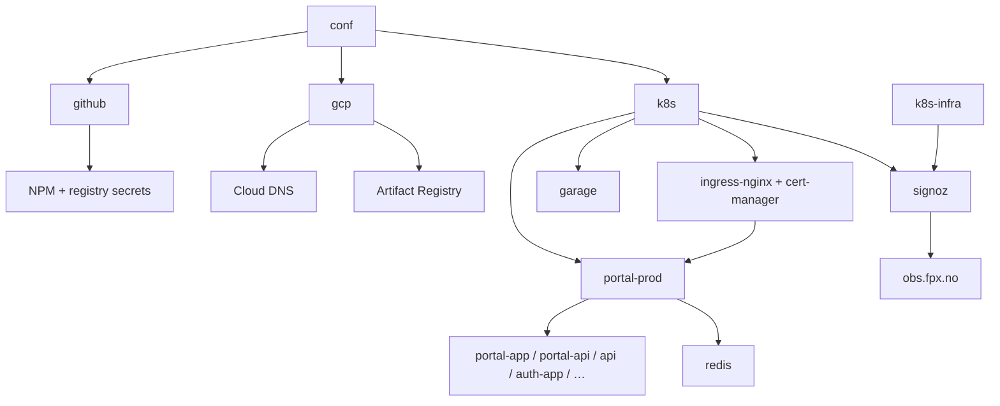

# conf

This repository contains code to deploy and configure for infrastructure related
to Flexi Soft.

We use Pulumi to manage infrastructure as code. Pulumi is a tool for creating,
deploying, and managing cloud infrastructure. It is open source and supports
multiple cloud providers.

We mainly use Kubernetes, deployed on the `dina-flexisoft` Talos cluster. DNS,
Artifact Registry and IAM still live in Google Cloud Platform.

## Prerequisites

- [Pulumi](https://www.pulumi.com/docs/get-started/install/)
- [Google Cloud SDK](https://cloud.google.com/sdk/docs/install)
- [kubectl](https://kubernetes.io/docs/tasks/tools/install-kubectl/)
- [Tailscale](https://tailscale.com/download) — the cluster API server has no
  public endpoint, so `pulumi up` only works from the tailnet
- [docker](https://docs.docker.com/get-docker/)
- [nodejs](https://nodejs.org/en/download/)
- [pnpm](https://pnpm.io/installation)

## Architecture

At the core is the `dina-flexisoft` Talos cluster — a single node. Application
workloads live in `portal-prod`; the rest of the platform sits in namespaces of
its own. [ingress-nginx] is the reverse proxy, and [cert-manager] issues SSL
certificates from Let's Encrypt.

[ingress-nginx]: https://kubernetes.github.io/ingress-nginx/
[cert-manager]: https://cert-manager.io/

Images are pulled from Google Artifact Registry using a dedicated reader service
account, whose key is mounted into the namespace as the `artifact-registry` pull
secret. GKE nodes used to authenticate with their own Google identity; Talos has
none, so this secret is what makes image pulls work at all.

The portal service uses Redis to store session data. It is ephemeral — a restart
logs everyone out.


```mermaid
flowchart TD
    conf-->github
    conf-->gcp
    conf-->k8s

    github-->bot-secret["NPM + registry secrets"]

    gcp-->dns["Cloud DNS"]
    gcp-->ar["Artifact Registry"]

    k8s-->portal-prod
    k8s-->signoz
    k8s-->garage
    k8s-->system["ingress-nginx + cert-manager"]

    system-->portal-prod

    portal-prod-->apps["portal-app / portal-api / api / auth-app / …"]
    portal-prod-->redis

    signoz-->obs["obs.fpx.no"]
    k8s-infra-->signoz
```

### Namespaces

| Namespace       | Contents                                            |
| --------------- | --------------------------------------------------- |
| `portal-prod`   | All application workloads, plus Redis               |
| `ingress-nginx` | Ingress controller                                  |
| `cert-manager`  | Certificate issuance, incl. the Cloud DNS solver    |
| `signoz`        | Observability stack, served at `obs.fpx.no`         |
| `k8s-infra`     | Telemetry collectors (needs a privileged PSA label) |
| `garage`        | S3-compatible object storage, cluster-internal      |

### Certificates

Certificates are wildcards, not one per host: `fpx.no` + `*.fpx.no` covers the
platform hosts and each tenant's apex, and one `*.<ident>.fpx.no` per tenant
covers their subdomains. Tenants on their own domains get per-host certificates.

Wildcards can only be validated over DNS-01, which is why cert-manager has a
Cloud DNS solver and its own service account. This matters: TLS wildcards match
a single label, so `*.fpx.no` does **not** cover `api.demo.fpx.no`.

### Object storage

[Garage](https://garagehq.deuxfleurs.fr/) provides an S3-compatible API at
`garage.garage.svc.cluster.local:3900`, capped at 200 GB. It is deliberately
cluster-internal — ClusterIP only, no ingress. Note that flannel does not
enforce NetworkPolicy, so nothing routes to it from outside, but in-cluster
traffic is unrestricted.

Garage needs its cluster layout assigned once before it will report ready:

```sh
kubectl -n garage exec garage-0 -- /garage status          # note the node ID
kubectl -n garage exec garage-0 -- /garage layout assign -z dc1 -c 200G <node-id>
kubectl -n garage exec garage-0 -- /garage layout apply --version 1
```

### Observability

SigNoz at [obs.fpx.no](https://obs.fpx.no) collects container logs, host and
kubelet metrics, cluster metrics and Kubernetes events. Alerts go to
`#flexi-soft-notifications`. Traces are not collected yet — that needs
per-application instrumentation.

See [docs/observability.md](docs/observability.md) for what is and isn't
collected, and the gotchas worth knowing before changing any of it.

We utilize a [12-factor] to manage most configuration.

[12-factor]: https://12factor.net/

## Custom domains DNS Configuration

When using a custom domain with our platform, customers need to configure DNS records pointing to our infrastructure.

### Recommended: CNAME Records

For maximum flexibility, we recommend using CNAME records pointing to our ingress hostname:

```dns
# Replace portal.example.com with your actual domain
portal.example.com.                 CNAME    ingress.fpx.no.
debitor.portal.example.com.         CNAME    ingress.fpx.no.
api.portal.example.com.             CNAME    ingress.fpx.no.
onboarding.portal.example.com.      CNAME    ingress.fpx.no.
rest.portal.example.com.            CNAME    ingress.fpx.no.
```

### Alternative: A Records

If you need to use your root domain or your DNS provider doesn't support CNAME records for your use case (e.g. MX record conflicts), use A records pointing to our static IP:

```dns
# Replace example.com with your domain and <IP> with the actual IP
example.com.                 A        <IP>
debitor.example.com.         A        <IP>
api.example.com.             A        <IP>
onboarding.example.com.      A        <IP>
rest.example.com.           A         <IP>
```

> **Note**: CNAME records cannot be used for root domains. If you want to use your root domain as the main portal, you must use an A record for that specific record.
